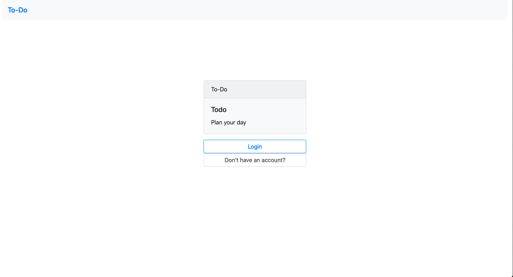
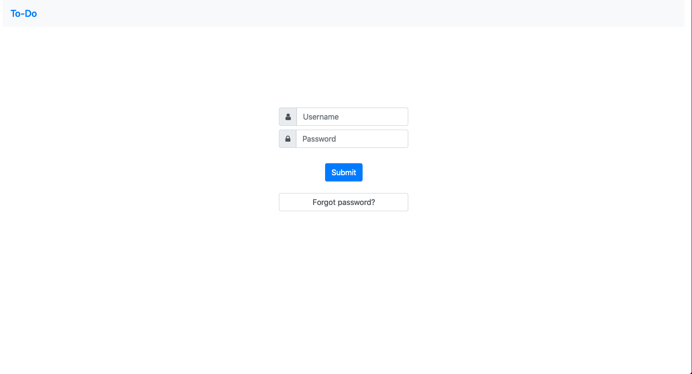
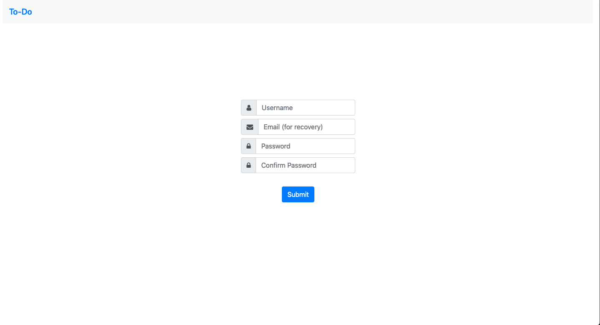
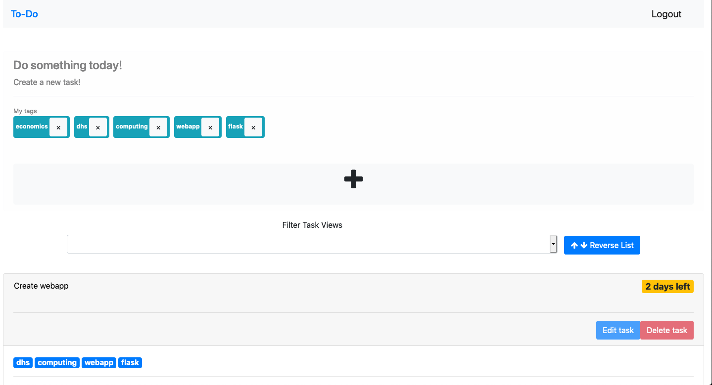
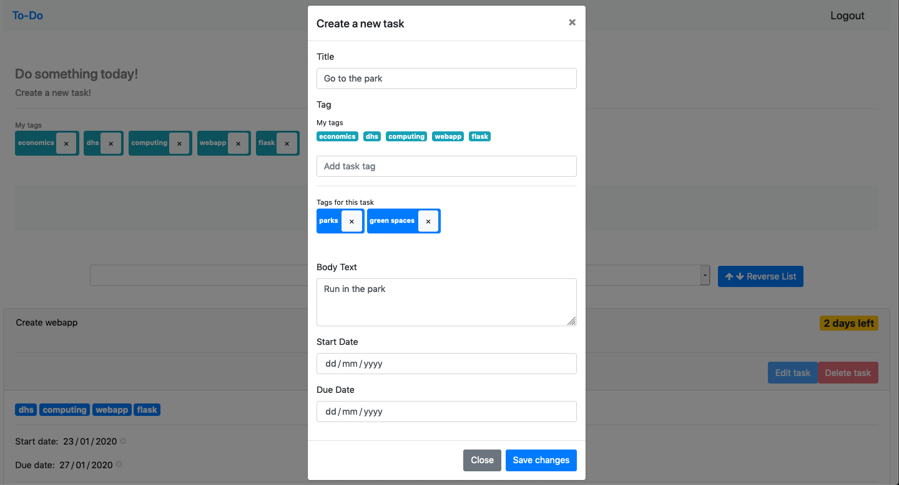
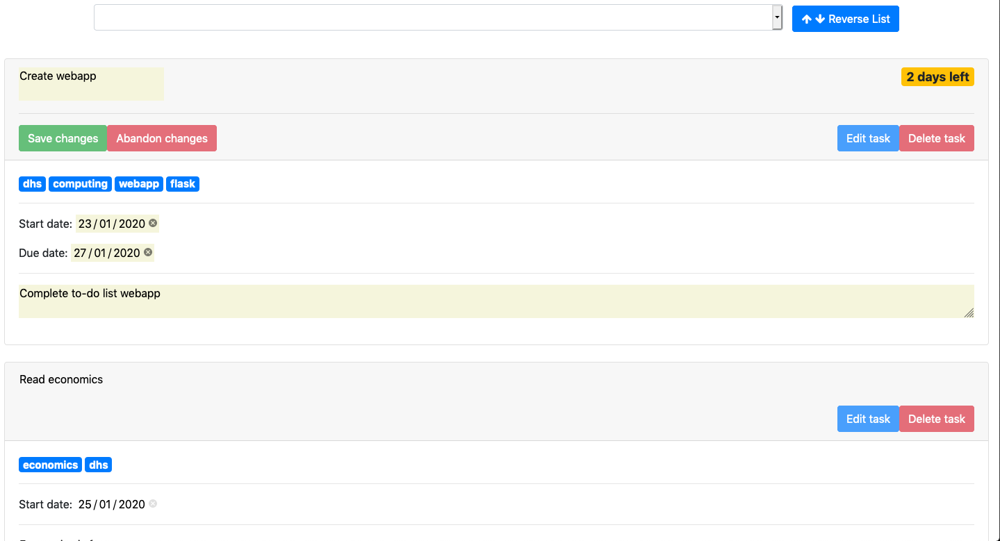
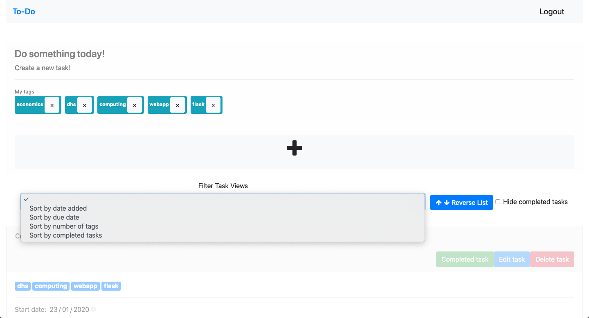

# ToDo: Plan your day

## Getting started

### Prerequisites

1. Install required modules

```
alembic==1.3.1
Flask==1.1.1
Flask-Login==0.4.1
Flask-Migrate==2.5.2
Flask-SQLAlchemy==2.4.1
python-dotenv==0.10.3
SQLAlchemy==1.3.11
Werkzeug==0.16.0
```

2. Create a .env file, which stores the environment variables needed for the application

### Technologies
1. Flask
2. HTML/CSS (Bootstrap) /JS
3. sqlite3

## Routes

### Main Page


### Login Page

* Validation for correct username and password
* Hashing of passwords to reduce vulnerability of application
* TODO: email recovery if user forgets password

### Sign Up Page

* Validation checking for all input fields
* Hashing of passwords to reduce vulnerability of application

### Dashboard

* A dashboard showing tasks created
* Tags above are not currently clickable, but can be deleted (if they are not currently used in any of the tasks)
* TODO: user notifications for tasks, add a delete account function

### Create task

* A modal form using Bootstrap
* Client-side (JS) validation to ensure validity of dates, before the data is sent to server
* Able to dynamically add task tags to the panel (e.g. in the input field for 'add task tag', simply add a desired tag, then click enter, and it will appear under 'tags for this task')
* TODO: enable user to add existing task tags by clicking on them

### Edit task

* Editing of tasks with appropriate validation for dates before data is sent to server
* Makes use of the value attribute in HTML elements
* Allows user to abandon changes as the original data is stored in the localStorage (will be cleared when user abandons, or when user submits)
* Input fields are initially readonly and the borders and background are handled appropriately to ensure that it blends in with the card
* Highlighting of input fields to let the user knows which fields can be edited
* TODO: editable tags

### Sorting

* Allows user to sort by the above filters, as well as reverse the list (by manipulating the children within the HTML DOM)
* TODO: add more sort filters, allow user to view tasks with a certain tag

## Overall TODO
1. Integrate with Google Login
2. Add a calendar view to display the user's tasks that could possible be integrated to the user's Google Calendar
3. Add a progress tracker to track user's completion of tasks
4. Allow for adding of fellow users to track task progress
